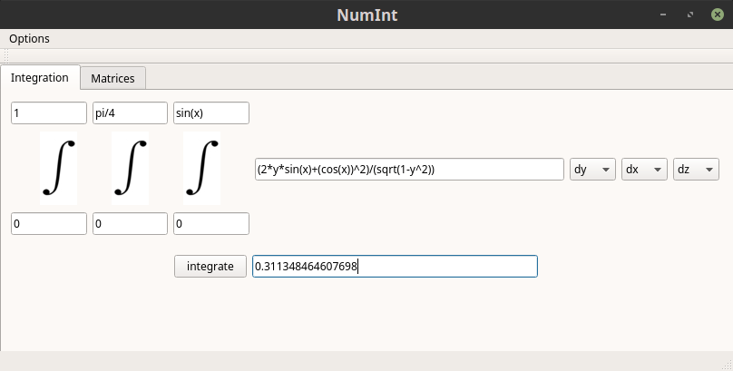
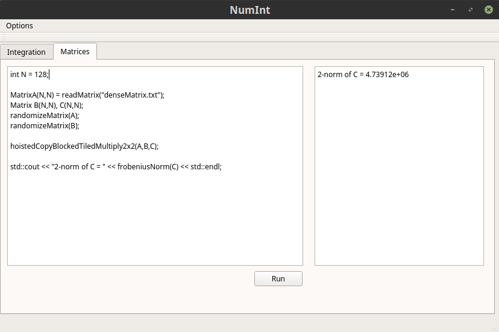

## NumInt
Qt application for computing triple integrals by Gaussian Quadrature rules and testing [HPC-library](https://github.com/JohnSell620/HPC-Library) matrix computations.

## Installation
- This project requires Qt. Installation instructions for Ubuntu can be found [here](https://wiki.qt.io/Install_Qt_5_on_Ubuntu).
- After Qt installation, run the following commands to set up and run project application.
```
$ git clone https://github.com/JohnSell620/NumInt.git
$ cd NumInt
$ mv Forms/* Headers/* Resources/* Sources/* && rmdir Forms Headers Resources Sources
$ cd ../build
$ make
$ ./NumInt
```


## Acknowledgements
[C++ Mathematical Expression Parsing And Evaluation Library](https://github.com/ArashPartow/exprtk) by Arash Partow is used in `gaussquadrature.cpp`.



